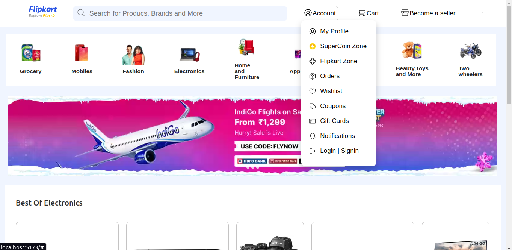
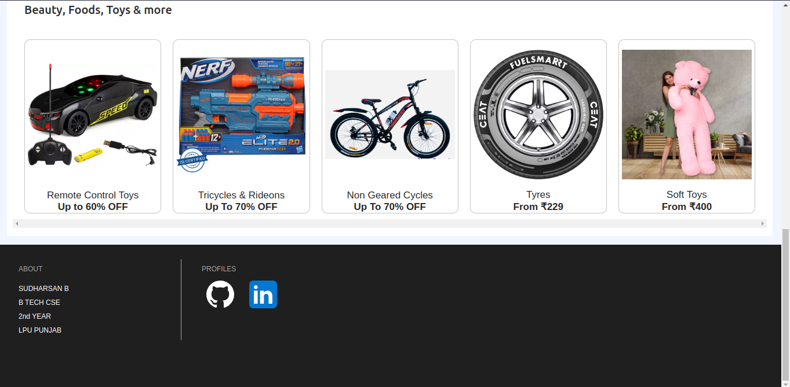
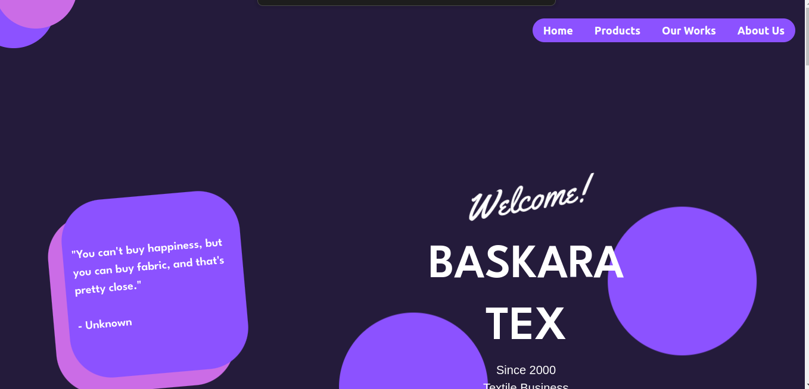
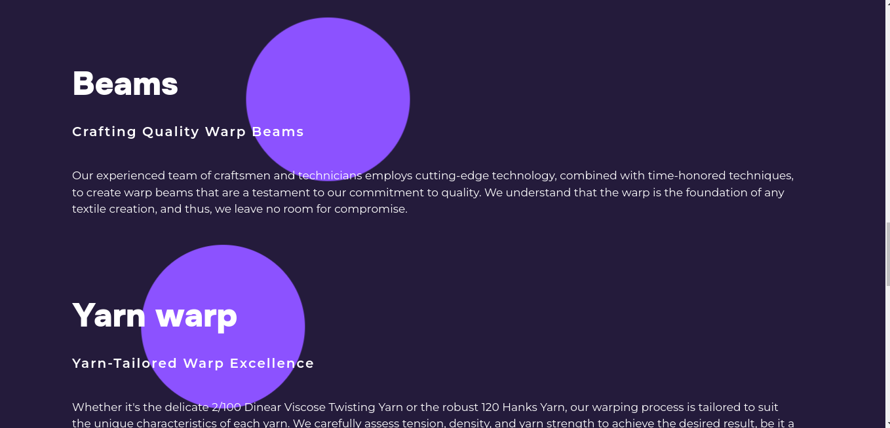
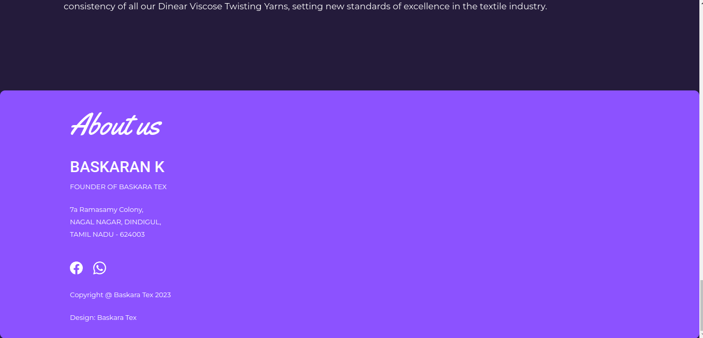

<h1 align="center">⭐ Hello Friends, this is 😄 Sudharsan</h1>
<h1 align="left">About</h1>

I am a passionate, hungry person when it comes to 🔭 technology; I'm eager to learn about the diverse job roles in computer science and engineering, while continuously accruing knowledge and updating my skills.</h3>

<h1 align="left">Skills</h1>

🖥️ FullStack (HTML,CSS,JS,ReactJs,MERN Stack...)

🛸 Object Oriented Programming (PYTHON,C++)

🗃️ Data Structures and Algorithms (C++)

💾 Data Base Management System (SQL,MySQL,Mongodb,Nodejs,Expressjs)

<h1 align="left">Projects</h1>

🖥️ Flipkart Clone (2023 December)

~ <b> Skills</b> (HTML,CSS,REACT,NODE,EXPRESS,AXIOS,MONGODB)

~ https://github.com/25sudharsan27/flipkart-clone.git

**Screenshots**

🖥️ Baskara Tex (2023 October)

~<b> Skills</b> (HTML,CSS,BOOTSTRAP,SEO)

~ http://baskaratex.liveblog365.com/

**Screenshots**

🖥️ Biodiversity Website (2023 April)

~ <b>Skills</b> (HTML,CSS,BOOTSTRAP,SEO)

~ http://sudharsan.liveblog365.com/

🛸 Personal Finance Management System (2023 March)

~ <b>Skills</b> (PYTHON,Tkinter,SQL,Numpy,openpyxl)

~ https://github.com/25sudharsan27/Personal-finance-Management-System

<h1 align="left">Connect</h1>
📫 25sudharsan27@gmail.com

